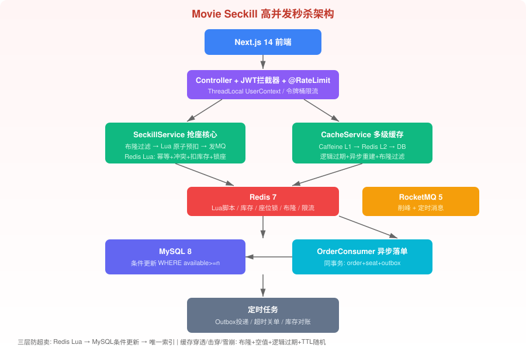

# Movie Seckill 电影票秒杀系统

> Java 21 + Spring Boot 3 + MyBatis-Plus + MySQL + Redis + RocketMQ + Caffeine + Outbox 高并发秒杀演示项目，用于 Java 后端岗位面试。



## 技术亮点

- **Redis + Lua 原子抢座**：一次脚本完成 requestId 幂等、座位冲突检查、库存预扣、座位锁定，杜绝超卖和座位重售
- **三层防超卖**：Redis Lua 预扣 → MySQL `UPDATE ... WHERE available>=n` 条件更新 → `seat_lock UNIQUE(schedule_id,row,col)` 唯一索引兜底
- **多级缓存**：Caffeine L1 + Redis L2 + 布隆过滤器 + 空值缓存 + 逻辑过期 + Redisson 异步重建，覆盖缓存穿透/击穿/雪崩
- **Outbox + RocketMQ 削峰**：订单与 outbox_event 同事务写入，MQ 异步落单把瞬时洪峰摊平；RocketMQ 5 定时消息 + DB 扫描双兜底关单
- **令牌桶限流**：Redis Lua 令牌桶 + AOP + 用户维度策略
- **JWT 双 Token**：AccessToken(30min) + RefreshToken(7d) + ThreadLocal 用户上下文
- **设计模式**：策略(限流粒度)、模板方法(缓存重建)、工厂(MQ事件路由)、观察者(订单后续)

## 技术栈

| 层 | 选型 |
|---|---|
| 后端 | Java 21, Spring Boot 3.3, MyBatis-Plus 3.5 |
| 存储 | MySQL 8, Redis 7, Caffeine, Redisson |
| 消息 | RocketMQ 5 |
| 前端 | Next.js 14, React 18, TypeScript, Tailwind |
| 部署 | Docker Compose |
| 文档 | Knife4j / OpenAPI3 (`/doc.html`) |

## 快速启动

```bash
# 1. 启动中间件（MySQL/Redis/RocketMQ）
cp .env.example .env
docker compose -f deploy/docker/compose.infra.yml up -d

# 2. 启动后端（本地开发）
cd backend
mvn spring-boot:run
# 访问 http://localhost:8080/doc.html 查看接口

# 3. 启动前端
cd ../frontend
npm install
npm run dev
# 访问 http://localhost:3000
```

## 项目结构

```
├── backend/                # Spring Boot 后端（MVC 单模块）
│   └── src/main/java/com/wangning/seckill/
│       ├── common/         # Result/异常/ThreadLocal/常量/工具
│       ├── config/         # Redis/Redisson/Caffeine/MyBatis/Web/Knife4j
│       ├── controller/     # MVC 的 C
│       ├── service/        # 业务接口
│       │   └── impl/       # 业务实现
│       ├── mapper/         # MVC 的 M（MyBatis-Plus）+ resources/mapper/*.xml
│       ├── entity/ dto/ vo/
│       ├── lua/            # Redis Lua 脚本
│       ├── mq/              # RocketMQ producer/consumer
│       ├── job/            # Outbox投递/订单超时/库存对账
│       └── cache/          # 多级缓存/布隆过滤器
├── frontend/               # Next.js 前端
├── deploy/docker/          # Compose: MySQL/Redis/RocketMQ/Nginx
└── docs/                   # 开发文档
```

## 核心链路

```
选座提交 → 令牌桶限流 → 布隆过滤 → Redis Lua 原子抢座
  → 立即返回"排队中" → RocketMQ 异步落单
  → MySQL 条件更新 + 唯一索引兜底
  → 用户轮询订单 → 模拟支付 → 座位置已售
  → 超时未支付 → MQ定时消息 + DB扫描关单 → Lua 返还库存
```

## 默认测试账号

| 账号 | 密码 |
|---|---|
| 13800000001 | 123456 |
| 13800000002 | 123456 |
