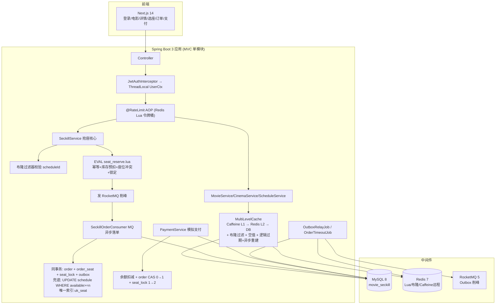
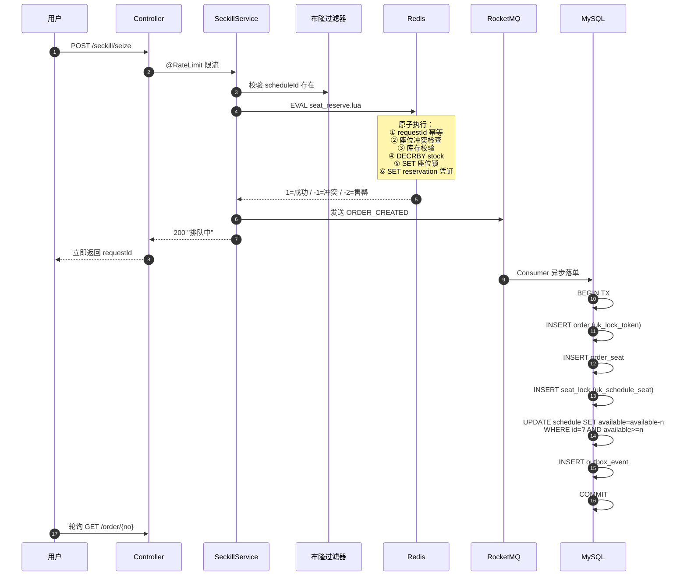

# Movie Seckill 电影票秒杀系统 — 开发文档（v2 选座版）

> 目标：在 `movie-seckill` 仓库下从零搭建一套 **Java 21 + Spring Boot 3 + MVC 分层** 的电影票秒杀后端，配合可运行的前端，用于 Java 后端岗位面试展示。
>
> v2 变更：根据确认，**加回选座锁座、影院列表、模拟支付流程**；保留原仓库前端的 UI 设计，但后端 API 全部按高并发秒杀标准重写。

---

## 1. 项目定位与业务范围

### 1.1 做什么
一个**带选座的电影票秒杀**系统：用户登录后浏览正在热映的电影、选择影院和场次、在座位图上选座并提交订单。核心高并发场景是**同一场次热门座位的抢座**，读多写少的电影/影院/场次展示走多级缓存。

### 1.2 业务闭环
```
注册/登录
  → 电影列表（多级缓存）
  → 电影详情 + 正在上映影院/场次列表（多级缓存）
  → 影院详情 + 场次列表
  → 选座页：座位图查询
  → 点"提交订单"
       ① 令牌桶限流（用户维度）
       ② 布隆过滤器校验场次存在
       ③ Redis Lua 原子：requestId 幂等 + 场次库存校验/预扣 + 所选座位冲突检查 + 座位锁定
  → 成功立即返回"排队中"，发 RocketMQ 异步落单
  → 用户轮询订单状态 / 订单列表
  → 模拟支付（扣积分 → 订单状态 CAS → seat_lock 置已售 → Outbox 发下游事件）
  → 超时未支付：DB 扫描关单 + Outbox 释放事件，Lua 返还 Redis 库存/释放座位
```

### 1.3 保留与砍掉
- **保留**：电影、影院、场次、选座锁座、订单、模拟支付、订单列表/详情。
- **砍掉**：城市/行政区/地铁/品牌等多维筛选（前端做简化筛选即可）、真实支付宝/微信支付（模拟支付接口）、用户积分体系（用一个余额字段代替，支付直接扣减）。

---

## 2. 技术栈与版本选型（已确认）

| 层次 | 选型 | 版本 |
|---|---|---|
| 语言 | Java | **21 (LTS)** |
| 框架 | Spring Boot | **3.3.x** |
| 持久层 | MyBatis-Plus | 3.5.x |
| 数据库 | MySQL | **8.0**（Docker） |
| 缓存 | Redis | **7.x**（Docker） |
| 分布式锁 | Redisson | 3.x |
| 本地缓存 | Caffeine | 随 Spring Boot |
| 消息队列 | RocketMQ | **5.x**（Docker，Outbox Relay 异步投递） |
| JWT | jjwt | 0.12.x |
| API 文档 | **Knife4j (OpenAPI3)** | 4.x — 面试可直接打开网页演示接口 |
| 限流 | Redis Lua 自实现令牌桶 | — |
| 构建 | Maven | 3.9+ |
| 前端 | Next.js 14 + React 18 + TS + Tailwind + Zustand + Axios | 参考原仓库 frontend UI 改造 |
| 部署 | Docker Compose | infra + app 两栈 |
| 压测 | Docker 化 k6（读、冲突、批量、限流） | |

---

## 3. 整体架构



---

## 4. 后端包结构（单模块 MVC）

`backend/src/main/java/com/wangning/seckill/`

```
├── SeckillApplication.java
├── common/
│   ├── result/Result.java
│   ├── exception/BizException.java + GlobalExceptionHandler
│   ├── context/UserContextHolder.java   # ThreadLocal
│   ├── constant/CacheKeyConstants / MQConstants
│   └── util/JwtUtil.java / BCryptUtil.java
├── config/
│   ├── RedisConfig / RedissonConfig / CaffeineConfig
│   ├── MyBatisPlusConfig / WebMvcConfig / ThreadPoolConfig
│   ├── RocketMQConfig / Knife4jConfig
├── controller/
│   ├── AuthController / MovieController / CinemaController
│   ├── ScheduleController / SeatController
│   └── OrderController / PaymentController
├── service/  (接口 + impl/)
│   ├── AuthService / MovieService / CinemaService
│   ├── ScheduleService / SeatService / OrderService / PaymentService
├── mapper/   (MyBatis-Plus Mapper)
│   ├── UserMapper / MovieMapper / CinemaMapper
│   ├── ScheduleMapper / SeatLockMapper
│   ├── OrderMapper / OrderSeatMapper / OutboxEventMapper
├── entity/   (PO)
├── dto/ vo/  (record)
├── lua/      (resources/lua/*.lua)
│   ├── seat_reserve.lua      # 抢座核心
│   ├── seat_release.lua      # 关单/取消返还
│   ├── seat_mark_sold.lua    # 支付成功清锁
│   └── token_bucket.lua
├── mq/
│   └── consumer/SeckillOrderConsumer / InventoryEventConsumer
├── job/
│   ├── OutboxRelayJob / OrderTimeoutJob
└── cache/
    ├── MultiLevelCacheManager
    ├── BloomFilterService
    └── CacheRebuildExecutor
```

---

## 5. 数据库表设计（MySQL 8，库名 `movie_seckill`）

### 5.1 `sys_user`
```sql
CREATE TABLE sys_user (
  id          BIGINT PRIMARY KEY AUTO_INCREMENT,
  account     VARCHAR(64) NOT NULL UNIQUE,
  password    VARCHAR(128) NOT NULL COMMENT 'BCrypt',
  nickname    VARCHAR(64),
  balance     INT DEFAULT 1000 COMMENT '模拟余额(分)，支付扣减',
  create_time DATETIME DEFAULT CURRENT_TIMESTAMP,
  update_time DATETIME DEFAULT CURRENT_TIMESTAMP ON UPDATE CURRENT_TIMESTAMP
);
```

### 5.2 `movie`（展示用，读多写少）
```sql
CREATE TABLE movie (
  id          BIGINT PRIMARY KEY AUTO_INCREMENT,
  name        VARCHAR(200) NOT NULL,
  poster      VARCHAR(500),
  score       DECIMAL(3,1) DEFAULT 0,
  actors      VARCHAR(500),
  genre       VARCHAR(100),
  duration    INT,
  description TEXT,
  status      TINYINT DEFAULT 1 COMMENT '1热映 2即将上映',
  version     INT DEFAULT 0,
  create_time DATETIME DEFAULT CURRENT_TIMESTAMP,
  update_time DATETIME DEFAULT CURRENT_TIMESTAMP ON UPDATE CURRENT_TIMESTAMP,
  KEY idx_status (status)
);
```

### 5.3 `cinema`（影院，简化版）
```sql
CREATE TABLE cinema (
  id          BIGINT PRIMARY KEY AUTO_INCREMENT,
  name        VARCHAR(200) NOT NULL,
  address     VARCHAR(500),
  city        VARCHAR(64),
  create_time DATETIME DEFAULT CURRENT_TIMESTAMP,
  update_time DATETIME DEFAULT CURRENT_TIMESTAMP ON UPDATE CURRENT_TIMESTAMP
);
```

### 5.4 `movie_schedule`（场次 — 防超卖核心表）
```sql
CREATE TABLE movie_schedule (
  id              BIGINT PRIMARY KEY AUTO_INCREMENT,
  movie_id        BIGINT NOT NULL,
  cinema_id       BIGINT NOT NULL,
  hall_name       VARCHAR(50),
  show_date       DATE NOT NULL,
  show_time       VARCHAR(10) NOT NULL,
  total_seats     INT NOT NULL DEFAULT 120,
  available_seats INT NOT NULL DEFAULT 120,
  price           DECIMAL(10,2) NOT NULL DEFAULT 39.90,
  status          TINYINT DEFAULT 1 COMMENT '1可售 0停售',
  version         INT DEFAULT 0 COMMENT '乐观锁',
  create_time     DATETIME DEFAULT CURRENT_TIMESTAMP,
  update_time     DATETIME DEFAULT CURRENT_TIMESTAMP ON UPDATE CURRENT_TIMESTAMP,
  KEY idx_movie_date (movie_id, show_date),
  KEY idx_cinema_date (cinema_id, show_date)
);
```

### 5.5 `seat_lock`（座位锁定 — 高并发核心表）
```sql
CREATE TABLE seat_lock (
  id          BIGINT PRIMARY KEY AUTO_INCREMENT,
  schedule_id BIGINT NOT NULL,
  row_num     INT NOT NULL,
  col_num     INT NOT NULL,
  user_id     BIGINT NOT NULL,
  lock_token  VARCHAR(64) NOT NULL COMMENT '= requestId',
  order_no    VARCHAR(64),
  lock_until  DATETIME NOT NULL,
  status      TINYINT DEFAULT 1 COMMENT '1锁定中 0已释放 2已售',
  create_time DATETIME DEFAULT CURRENT_TIMESTAMP,
  update_time DATETIME DEFAULT CURRENT_TIMESTAMP ON UPDATE CURRENT_TIMESTAMP,
  -- 核心兜底：同一场次同一座位只能被一人锁
  UNIQUE KEY uk_seat (schedule_id, row_num, col_num),
  KEY idx_schedule_status (schedule_id, status),
  KEY idx_lock_until (lock_until, status)
);
```

### 5.6 `ticket_order`（订单）
```sql
CREATE TABLE ticket_order (
  id          BIGINT PRIMARY KEY AUTO_INCREMENT,
  order_no    VARCHAR(64) NOT NULL UNIQUE,
  user_id     BIGINT NOT NULL,
  schedule_id BIGINT NOT NULL,
  lock_token  VARCHAR(64) NOT NULL COMMENT '幂等键=requestId',
  movie_name  VARCHAR(200),
  cinema_name VARCHAR(200),
  show_time   VARCHAR(30),
  seat_count  INT NOT NULL DEFAULT 1,
  seats_info  VARCHAR(500),
  total_price DECIMAL(10,2),
  status      TINYINT DEFAULT 0 COMMENT '0待支付 1已支付 2已取消',
  expire_time DATETIME NOT NULL,
  pay_time    DATETIME NULL,
  create_time DATETIME DEFAULT CURRENT_TIMESTAMP,
  update_time DATETIME DEFAULT CURRENT_TIMESTAMP ON UPDATE CURRENT_TIMESTAMP,
  UNIQUE KEY uk_lock_token (lock_token),
  KEY idx_user (user_id, status)
);
```

### 5.7 `order_seat`（订单座位明细）
```sql
CREATE TABLE order_seat (
  id          BIGINT PRIMARY KEY AUTO_INCREMENT,
  order_id    BIGINT NOT NULL,
  order_no    VARCHAR(64) NOT NULL,
  schedule_id BIGINT NOT NULL,
  row_num     INT NOT NULL,
  col_num     INT NOT NULL,
  create_time DATETIME DEFAULT CURRENT_TIMESTAMP,
  UNIQUE KEY uk_schedule_seat (schedule_id, row_num, col_num)
);
```

### 5.8 `outbox_event`（本地消息表）
```sql
CREATE TABLE outbox_event (
  id           BIGINT PRIMARY KEY AUTO_INCREMENT,
  event_type   VARCHAR(64) NOT NULL,
  topic        VARCHAR(128) NOT NULL,
  payload      TEXT NOT NULL,
  status       VARCHAR(16) NOT NULL DEFAULT 'PENDING' COMMENT 'PENDING/SENT/DEAD',
  retry_count  INT DEFAULT 0,
  max_retry    INT DEFAULT 10,
  create_time  DATETIME DEFAULT CURRENT_TIMESTAMP,
  sent_time    DATETIME NULL,
  KEY idx_status_create (status, create_time)
);
```

---

## 6. 抢座核心链路（最重点）

### 6.1 时序



### 6.2 Lua 脚本 `seat_reserve.lua`（面试必背）
```lua
-- KEYS[1] = seckill:stock:{scheduleId}
-- KEYS[2] = seckill:reservation:{requestId}
-- KEYS[3..] = seckill:seat:{scheduleId}:{row}-{col}
-- ARGV: userId, requestId, seatLockTtl, reservationTtl, seatCount

-- ① 幂等：同 requestId 重复请求直接成功
local existing = redis.call('GET', KEYS[2])
if existing then return 2 end   -- 2=幂等成功

-- ② 座位冲突检查：任一座位被他人持有即失败
for i = 3, #KEYS do
  local owner = redis.call('GET', KEYS[i])
  if owner then
    -- owner 格式 "userId|requestId"；不是本人则冲突
    if string.sub(owner, 1, string.find(owner, '|')-1) ~= ARGV[1] then
      return -1   -- -1=座位被占
    end
  end
end

-- ③ 库存校验
local stock = tonumber(redis.call('GET', KEYS[1]) or '0')
if stock < tonumber(ARGV[5]) then
  return -2   -- -2=库存不足
end

-- ④⑤⑥ 原子预扣
redis.call('DECRBY', KEYS[1], ARGV[5])
for i = 3, #KEYS do
  redis.call('SET', KEYS[i], ARGV[1]..'|'..ARGV[2], 'EX', ARGV[3])
end
redis.call('SET', KEYS[2], ARGV[1]..'|'..ARGV[5], 'EX', ARGV[4])
return 1    -- 1=成功
```

**为什么用 Lua**：Redis 单线程执行 Lua 原子，把"幂等判断→座位冲突→库存校验→预扣→记锁"五步合一，避免并发超卖和座位抢重；比 Redisson 分布式锁串行化性能高一个数量级。

### 6.3 三层防超卖 / 防座位重售
| 层 | 手段 | 作用 |
|---|---|---|
| L1 | Redis Lua：库存预扣 + 座位 SETNX 锁 | 挡掉 99% 流量，座位不被两人同时锁 |
| L2 | MySQL `UPDATE schedule SET available=available-? WHERE available>=?` | Redis 异常后落库兜底，库存不扣成负 |
| L3 | `seat_lock UNIQUE(schedule_id,row_num,col_num)` | 极端并发下同一座位重复插入直接报错 |

### 6.4 关单/取消（`seat_release.lua`）
- 只有 `reservation` 一次性凭证还在、且 owner 匹配时才返还库存和删座位锁，**重复补偿不会重复加库存**。
- 支付成功走 `seat_mark_sold.lua`：删 reservation 凭证、把座位锁写入"已售"投影，**不返还库存**。

---

## 7. 缓存三大问题落地方案

| 问题 | 方案 |
|---|---|
| **穿透**（查不存在的场次/电影） | 布隆过滤器（应用启动+数据上架时加载 ID）+ 空值短 TTL 缓存（30s）|
| **击穿**（热点 key 过期瞬间回源） | 逻辑过期（value 带 expireTime，物理不过期）+ 异步线程重建 + Redisson 锁 `lock:rebuild:{key}` + Caffeine `get(key,loader)` 单实例合并 |
| **雪崩**（大量 key 同时过期） | TTL 加随机偏移（30min ± 5min）+ L1 Caffeine 兜底 + 接口限流 |

**读路径**：Caffeine(L1) → Redis(L2) → 布隆过滤 → DB（抢到 Redisson 重建锁才回源，否则读旧值）。
**缓存对象**：电影列表、电影详情、影院列表、影院详情、场次列表、座位图（座位图 Redis 实时，不做本地缓存）。

---

## 8. 令牌桶限流
- Redis Lua 令牌桶 `token_bucket.lua`，key = `rate:{userId}:{api}`。
- 注解 `@RateLimit(rate=10, interval=1)` + AOP 切面。
- **策略模式**：`RateLimitStrategy` 接口，User / IP / Global 三种实现。
- 抢座接口默认 10 QPS/用户，超过返回 429。

---

## 9. Outbox 与 RocketMQ 削峰
- **Outbox**：订单、order_seat、seat_lock、outbox_event 在**同一个 DB 事务**里写入；后台 `OutboxRelayJob` 扫 `PENDING` 投递 MQ，成功标记 SENT，失败重试 10 次转 DEAD。
- **削峰**：抢座入口通过 Redis Lua 原子预扣后只写入口 Outbox，Relay 投递 RocketMQ，消费者按 DB 可承受速率异步落单。
- **订单超时**：`OrderTimeoutJob` 每分钟扫 `status=0 AND expire_time<now()`，关单和释放 Outbox 在同一事务中写入，`seat_release.lua` 幂等返还 Redis。
- **库存事实**：MySQL 条件更新和 `seat_lock` 唯一键是最终兜底；Redis 库存由启动预热、抢座 Lua 和释放事件维护。

---

## 10. JWT 双 Token 与 ThreadLocal
- AccessToken 30 分钟、RefreshToken 7 天（存 Redis，支持登出失效）。
- `UserContextHolder` ThreadLocal 存 userId，拦截器 set，`afterCompletion` remove 防线程池串号。
- MQ/异步线程不继承 ThreadLocal，显式传 userId。

---

## 11. 设计模式
| 模式 | 落点 |
|---|---|
| 策略 | 限流粒度（User/IP/Global）|
| 工厂 | MQ 事件处理器按 eventType 路由 |
| 模板方法 | `AbstractCacheService` 定义 L1→L2→回源→回填骨架 |
| 观察者 | Spring ApplicationEvent + MQ 做订单后续通知/统计 |
| 代理 | AOP 限流/日志/事务 |

---

## 12. 分阶段开发计划（每阶段完成即 commit & push）

| 阶段 | 内容 |
|---|---|
| 1 | 后端脚手架（pom + Knife4j + 包结构）+ Docker Compose（MySQL/Redis/RocketMQ）+ 初始化 SQL + `v0.1-scaffold` |
| 2 | 用户注册/登录 + JWT 双 Token + ThreadLocal + 全局异常 + CORS + Knife4j 打通 `v0.2-auth` |
| 3 | 电影/影院/场次展示接口 + 多级缓存（Caffeine+Redis+布隆+空值+逻辑过期+异步重建）`v0.3-cache` |
| 4 | 令牌桶限流注解 + AOP + 策略模式 `v0.4-ratelimit` |
| 5 | 抢座核心链路（seat_reserve.lua + MQ 异步落单 + MySQL 唯一索引/条件更新兜底）`v0.5-seckill` |
| 6 | Outbox Relay + 订单超时关单回补 + 模拟支付 + 库存对账 `v0.6-outbox-pay` |
| 7 | 前端：基于原仓库 Next.js 改 登录/电影/影院/选座/订单/支付 页面 `v0.7-frontend` |
| 8 | Docker k6 压测 + 一致性校验 + README/面试文档同步 `v0.8-perf` |

### Commit 规范（Conventional Commits）
```
feat(cache): caffeine L1 + redis L2 multi-level cache with bloom filter
feat(seckill): redis lua seat reserve with stock pre-deduce and idempotency
feat(mq): outbox pattern with rocketmq async order persistence
perf(seckill): pre-warm stock to redis on startup
```
分支：`main` 保护，`dev` 开发，每阶段合并 main 打 tag。

---

## 13. 压测目标
| 指标 | 目标 |
|---|---|
| 抢座接口单机 QPS | ≥ 2000（Redis Lua 预扣，不等落单）|
| P99 RT | < 50ms |
| 超卖/座位重售 | 0（DB available 不为负，seat_lock 无重复座位）|
| 缓存综合命中率 | > 95% |
| 限流触发 | 超阈值 429，DB QPS 平稳 |

场景：① 1000 人抢 100 个座位；② 开/关多级缓存对比；③ 限流验证；④ MQ 削峰验证。

---

## 14. 已确认决策
- [x] 业务范围：**带选座的电影票秒杀**，保留影院/选座/支付页
- [x] Spring Boot **3.3.x**
- [x] RocketMQ **5.x**（Docker）
- [x] 压测：**Docker k6 场景 + MySQL/Redis/Outbox 校验**
- [x] 加 **Knife4j/Swagger**
- [x] 前端基于原仓库 UI 改造，保留影院/选座/支付页

---

## 15. 风险与取舍
- Redis 单点演示，生产可切 Cluster（Lua 用 hash tag 同 slot）。
- 模拟支付不接支付宝沙箱。
- 单体架构，面试重点在高并发设计而非服务治理。
