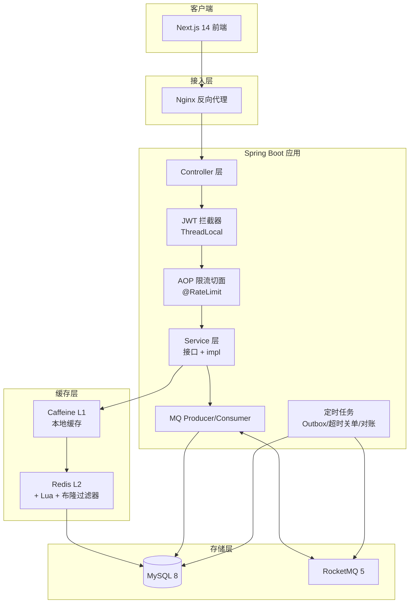
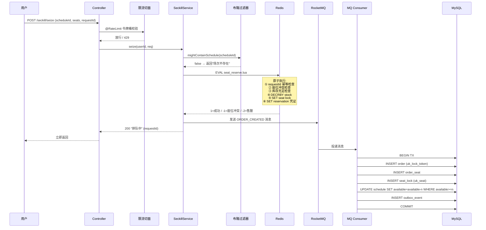
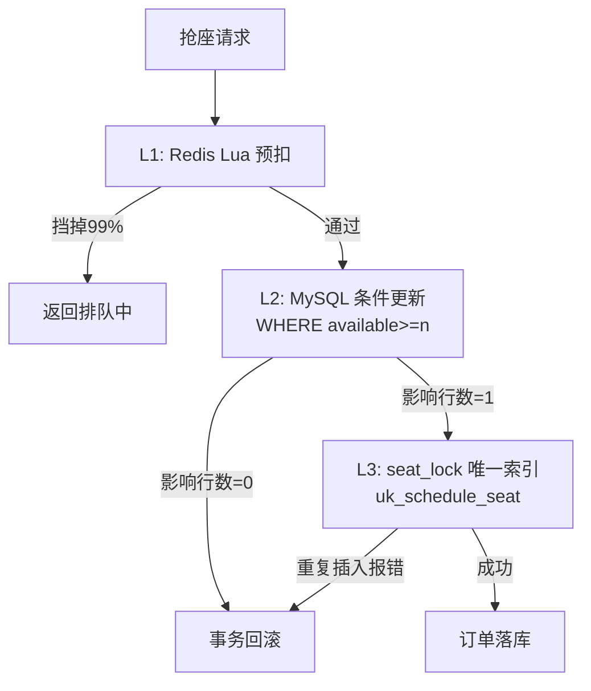
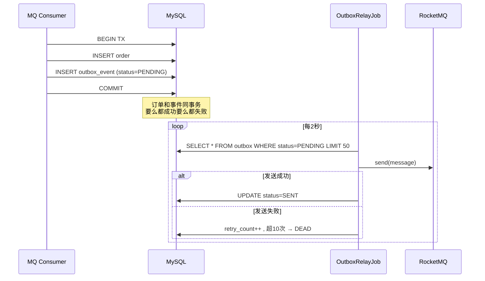
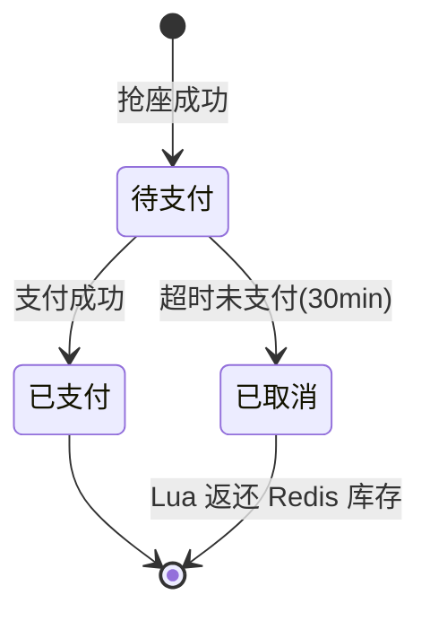

# 架构设计与技术亮点

> 本文档用 mermaid 图展示系统架构、核心链路和关键设计决策，配合代码阅读。

## 1. 整体架构



## 2. 抢座核心链路时序



## 3. 缓存三大问题解决方案

```mermaid
graph LR
    subgraph 读请求
        Q[查询请求]
    end

    Q --> L1[Caffeine L1<br/>命中?]
    L1 -- 命中 --> R1[返回]
    L1 -- 未命中 --> L2[Redis L2<br/>命中?]
    L2 -- 命中 --> L2CHECK{逻辑过期?}
    L2CHECK -- 未过期 --> R2[回填L1 返回]
    L2CHECK -- 已过期 --> ASYNC[异步重建<br/>@Async + Redisson锁] --> R2
    L2 -- 未命中 --> BLOOM{布隆过滤器<br/>存在?}
    BLOOM -- 不存在 --> NULL[写空值缓存<br/>30s TTL] --> R3[返回null]
    BLOOM -- 存在 --> LOCK[抢Redisson重建锁]
    LOCK -- 抢到 --> DB[查DB] --> PUT[写Redis+L1]
    LOCK -- 未抢到 --> WAIT[短暂等待重读]
```

| 问题 | 方案 |
|---|---|
| 缓存穿透 | 布隆过滤器 + 空值短 TTL |
| 缓存击穿 | 逻辑过期 + 异步重建 + Redisson 锁 |
| 缓存雪崩 | TTL 随机偏移 + L1 兜底 + 接口限流 |

## 4. 三层防超卖



## 5. Outbox 模式



## 6. 订单状态机



## 7. 包结构

```
com.wangning.seckill
├── SeckillApplication.java
├── common/           # Result, BizException, ThreadLocal, 常量, JwtUtil
├── config/           # Redis, Redisson, Caffeine, MyBatis, Web, Knife4j, 限流切面
├── controller/       # MVC 的 C
├── service/           # 业务接口
│   └── impl/          # 业务实现
├── mapper/            # MyBatis-Plus 接口
├── entity/ dto/ vo/   # PO / 请求 / 响应
├── lua/               # .lua 脚本
├── mq/                # producer / consumer
├── job/               # Outbox投递 / 超时关单 / 对账
└── cache/             # 多级缓存 / 布隆过滤器
```

## 8. 设计模式应用

| 模式 | 代码位置 | 作用 |
|---|---|---|
| 策略模式 | `RateLimitGranularity` + `RateLimitAspect` | 限流粒度可切换 USER/IP/GLOBAL |
| 模板方法 | `MultiLevelCacheManager.get()` | 定义 L1→L2→回源→回填骨架 |
| 工厂模式 | MQ Consumer 按 eventType 路由 | 不同事件走不同处理 |
| 观察者 | Spring `@TransactionalEventListener` | 订单事件异步触发通知 |
| 代理 | AOP 限流/日志/事务 | 横切关注点 |
| DTO/VO 分离 | dto/ 请求, vo/ 响应 | 不暴露 PO 字段 |
