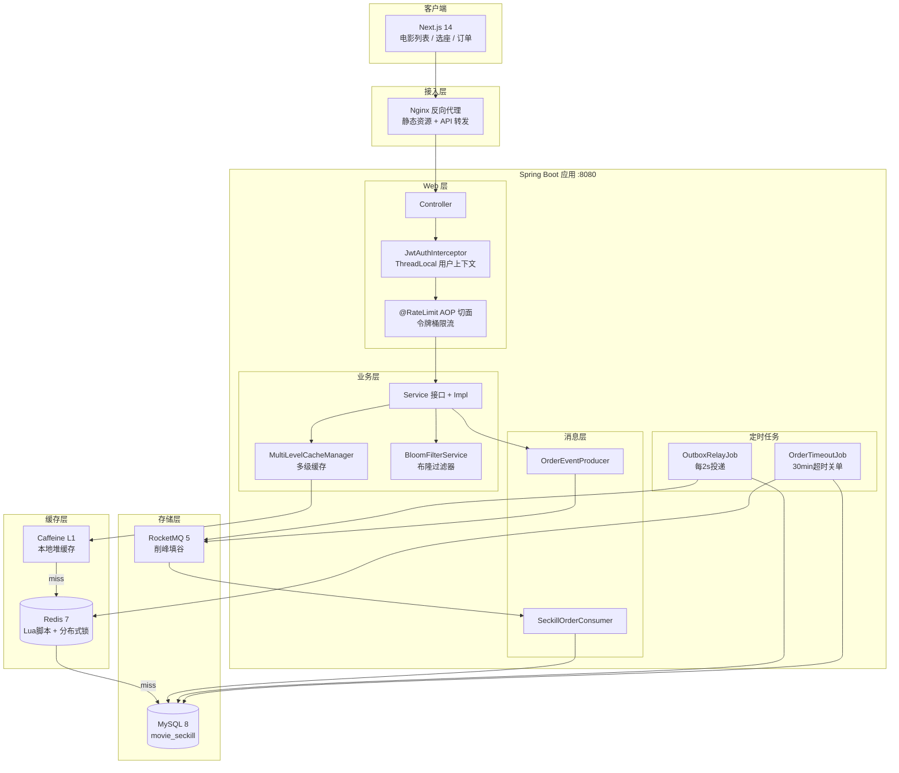
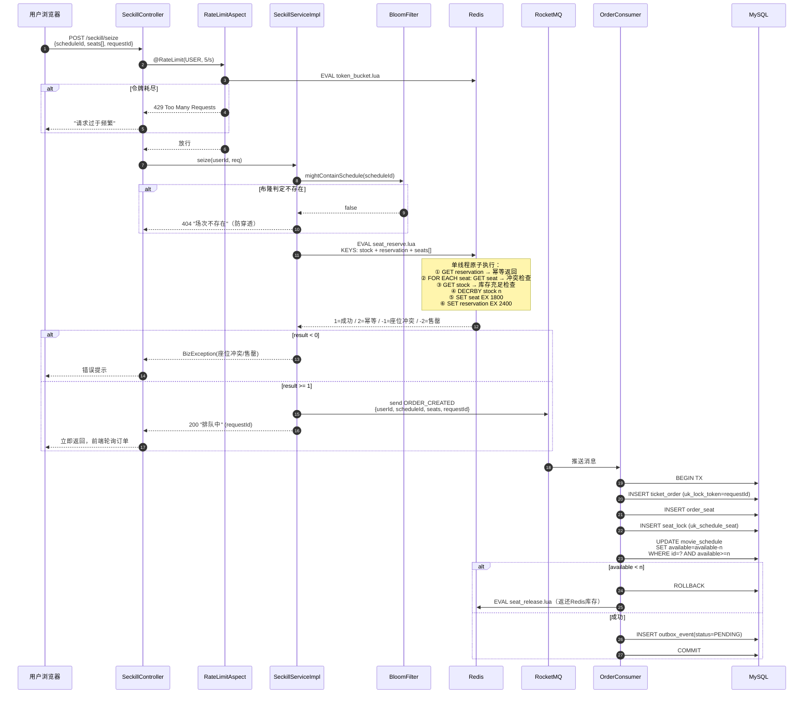
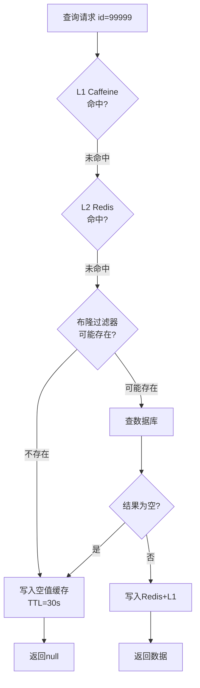
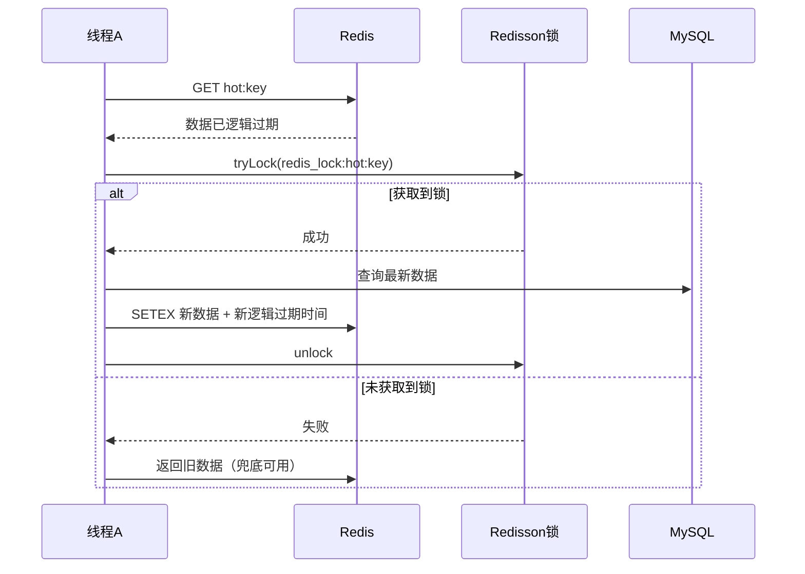
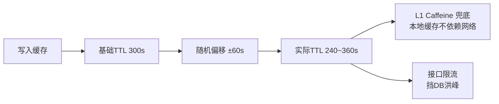
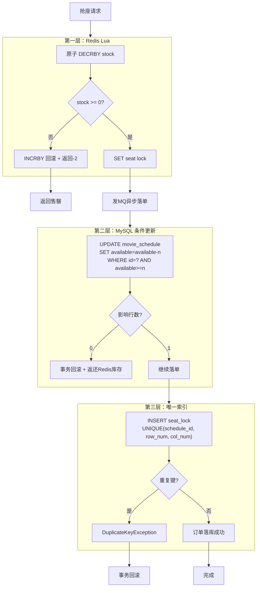
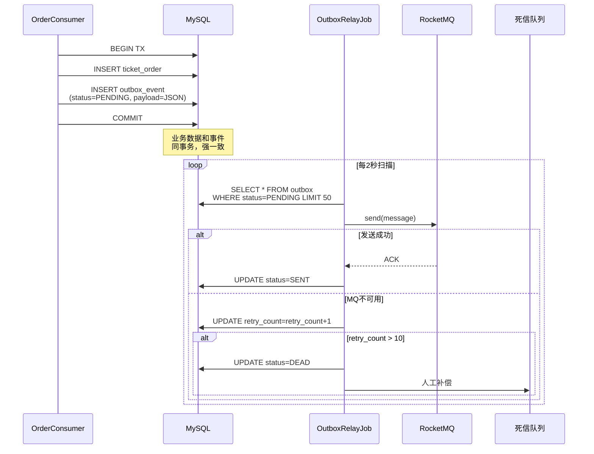
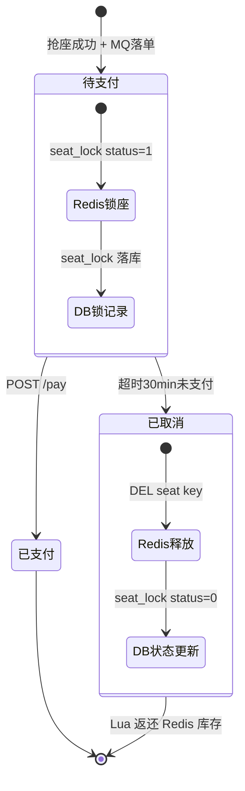
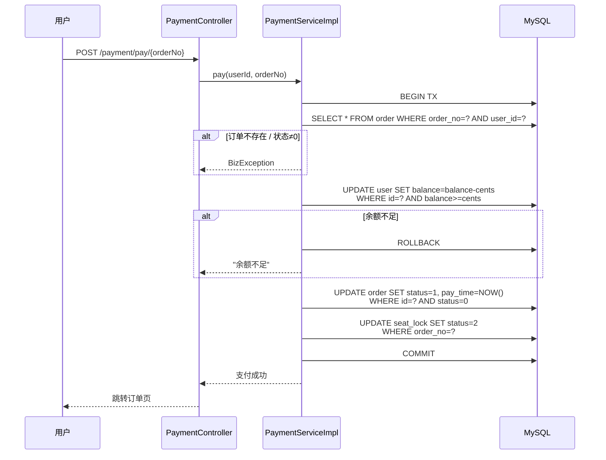
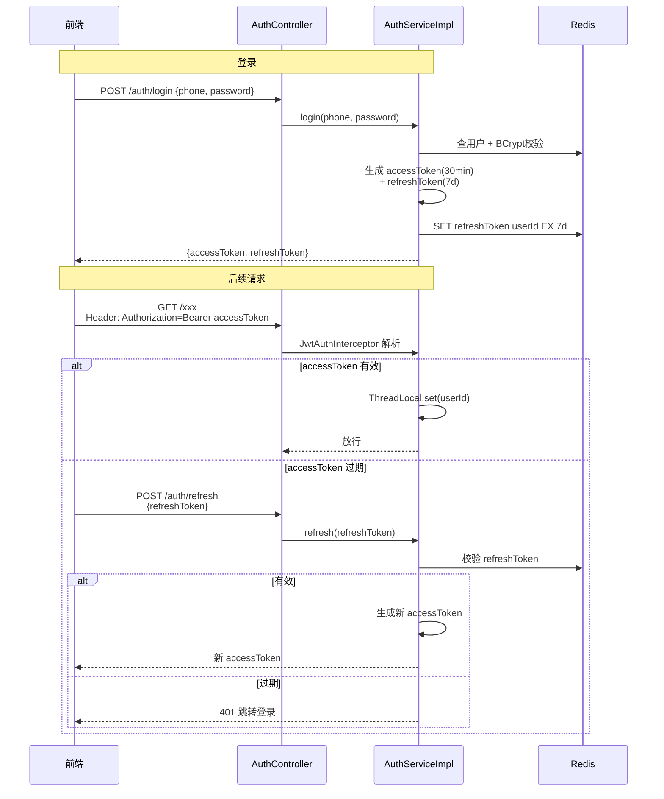

# 架构设计与技术亮点

> 本文档用 mermaid 图展示系统架构、核心链路和关键设计决策，配合代码阅读。

---

## 1. 系统整体架构



**分层职责：**
- **Web 层**：参数校验、JWT 鉴权、限流拦截，不写业务逻辑
- **业务层**：接口 + Impl 分离，策略/模板/工厂模式
- **缓存层**：L1 Caffeine 扛热点，L2 Redis 扛集群共享，布隆挡穿透
- **消息层**：RocketMQ 异步落单削峰，Outbox 保证最终一致
- **存储层**：MySQL 条件更新 + 唯一索引兜底

---

## 2. 抢座核心链路时序图



---

## 3. 缓存治理：穿透 / 击穿 / 雪崩

### 3.1 缓存穿透（查不存在的数据）



**双重防护**：布隆过滤器拦截大部分非法请求；即使布隆误判，空值短 TTL 兜底。

### 3.2 缓存击穿（热点 key 过期瞬间）



**核心**：逻辑过期 + 异步重建，不阻塞用户请求，旧数据先返回。

### 3.3 缓存雪崩（大量 key 同时过期）



**三招**：TTL 加随机偏移 + L1 本地缓存兜底 + 接口限流保护 DB。

---

## 4. 三层防超卖



---

## 5. Outbox 模式（消息可靠性）



**为什么不用本地消息表直接发？** 先写库后发 MQ，DB 提交和消息发送之间可能崩溃 → outbox 轮询兜底。

---

## 6. 订单状态机



---

## 7. 支付链路



---

## 8. JWT 双 Token 认证流程



---

## 9. 限流策略（令牌桶）

```mermaid
graph TD
    REQ[请求到达] --> ASPECT[RateLimitAspect]
    ASPECT --> GRAN{限流粒度?}
    GRAN -- USER --> ID1[userId]
    GRAN -- IP --> ID2[clientIp]
    GRAN -- GLOBAL --> ID3["global"]
    ID1 --> KEY[rate_limit:{identity}:{api}]
    ID2 --> KEY
    ID3 --> KEY
    KEY --> LUA[EVAL token_bucket.lua<br/>补充令牌 + 消费令牌]
    LUA --> RESULT{返回值}
    RESULT -- 1 --> PASS[放行]
    RESULT -- 0 --> REJECT[429 限流]
```

---

## 10. 设计模式应用

| 模式 | 代码位置 | 解决的问题 |
|---|---|---|
| 策略模式 | `RateLimitAspect` 中粒度切换 | 限流维度可配置，新增粒度不改主流程 |
| 模板方法 | `MultiLevelCacheManager.get()` | 固定 L1→L2→回源→回填骨架，子类/参数扩展 |
| 工厂模式 | MQ Consumer 按 eventType 分发 | 新增事件类型只需注册处理器 |
| 代理模式 | Spring AOP（限流/日志/事务） | 横切关注点与业务解耦 |
| DTO/VO 分离 | dto/ 请求体, vo/ 响应体 | 不暴露数据库实体，接口契约独立 |
| 接口+Impl | 所有 Service | 面向接口编程，便于替换实现和单测 |

---

## 11. 包结构

```
com.wangning.seckill
├── SeckillApplication.java
├── common/               # Result / BizException / ThreadLocal / JwtUtil / 常量
├── config/               # Redis / Redisson / Caffeine / MyBatis / Web / Knife4j / 限流切面
├── controller/           # MVC 的 C（REST 入口）
├── service/              # 业务接口
│   └── impl/             # 业务实现
├── mapper/               # MyBatis-Plus Mapper 接口
├── entity/ dto/ vo/      # PO / 请求 DTO / 响应 VO
├── resources/
│   ├── lua/              # seat_reserve.lua / seat_release.lua / token_bucket.lua
│   └── mapper/           # MyBatis XML（复杂 SQL）
├── mq/
│   ├── producer/         # OrderEventProducer
│   └── consumer/         # SeckillOrderConsumer
├── job/                  # OutboxRelayJob / OrderTimeoutJob
└── cache/                # MultiLevelCacheManager / BloomFilterService
```
